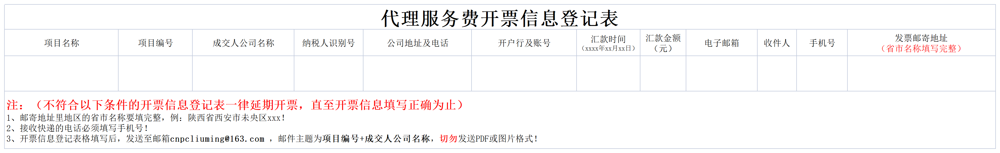

设想：  
1. 上传子表 > 解析数据 > 存储数据
2. 上传总表 > 解析数据 > 存储数据
3. 1和2不分优先级，解析数据后，优先对比库中的内容（项目编号、项目名称、成交人公司名称）
4. 若在库中找到相似数据，再次对比（收件人、手机号、发票邮寄地址），对比库中信息，无则新增，有则忽略
5. 搭建完整供应商邮寄信息库，将子表中的数据和库中数据进行对比（对比范围：成交人公司名称、收件人、手机号、发票邮寄地址）

> 2022年08月04日
>> 我想要一个属于我的女孩，所以，最后一次，我想成为那个带你回家的人。